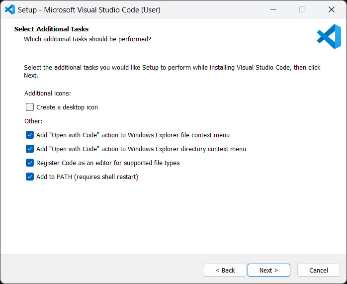
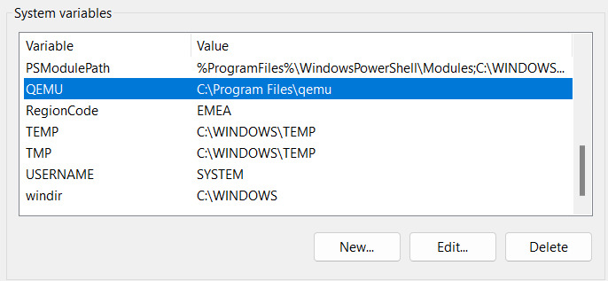
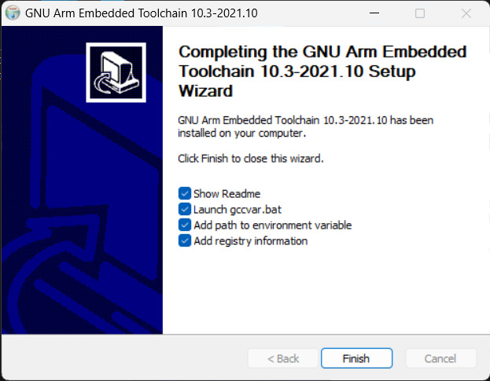
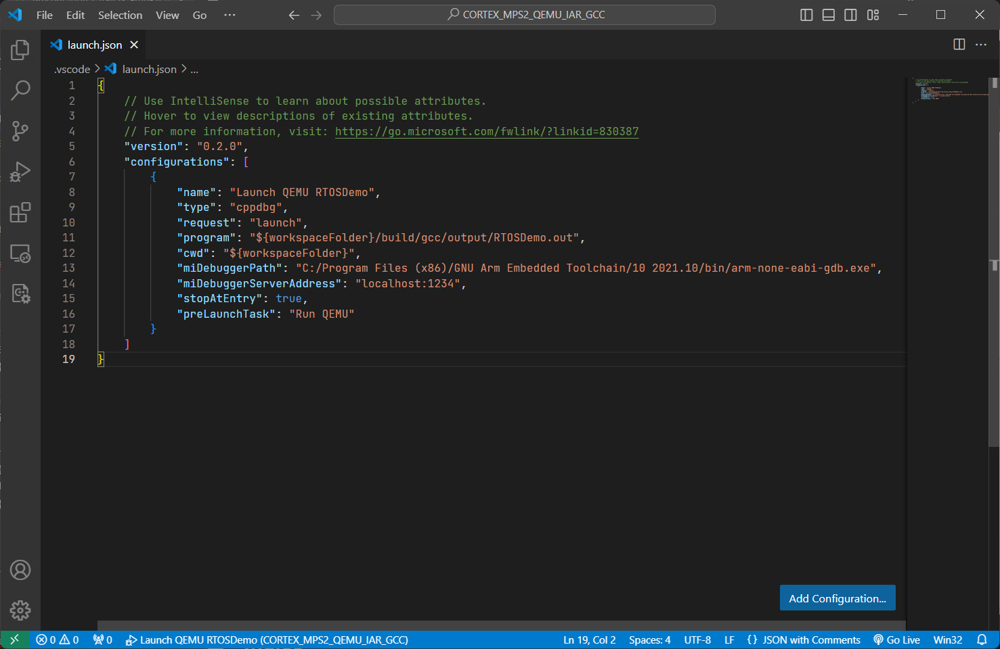

# HaclOSsim Project Content
The project aims to allow you to get hands-on experience with architecture and operating systems.

The assignment involves acquiring proficiency in utilizing an embedded operat-
ing system on an ISA simulator, specifically [QEMU](https://qemu.weilnetz.de/w64/),
and customizing it to implement a new, straightforward feature, followed by an
evaluation on significant workloads.

Operating system for the project include [FreeRTOS](https://www.freertos.org/index.html).

The primary objectives of this project are as follows:
1. Gain proficiency in using QEMU for running an embedded operating system and create a tutorial detailing the installation and usage procedures.
2. Develop practical examples/exercises demonstrating the functionality of the simulator/operating system in alignment with the topics studied in class.
3. Customize the operating system to implement a new solution (e.g., schedul- ing, memory management, etc.).
4. Evaluate and benchmark the performance improvement achieved by the newly implemented solution.

# Instructions for Building a Demo

1. **Install [Visual Studio Code](https://code.visualstudio.com/download)**
   - Download the VSCode version for **Windows (x64)**;
   - Manually run the installation file (.exe) if it does not start automatically;
   - Accept terms of use;
   - Choose the installation folder. The default selected folder is recommended;
   - Remember to check the “Add to Path” box to add the path to VSCode in the environment variables.
     <p align="center">
       
     </p>

2. **Download: [QEMU](https://qemu.weilnetz.de/w64/)**
   - Enter the folder called "2023/";
   - Click on “qemu-w64-setup-20231224.exe.” The download will start automatically;
   - After the installation is complete, add the path to QEMU in the **system** variables;
     - Note: the path is the installation folder chosen during the installation phase;
     - Open "Environment Variables";
     - Click on “New” in the System Variables;
     - Add variable name and path to QEMU.
       <p align="center">
         
       </p>

3. **Download and install the [GNU Arm Embedded Toolchain](https://developer.arm.com/downloads/-/gnu-rm)**
   - Install the version "gcc-arm-none-eabi-10.3-2021.10-win32.exe";
   - Choose the installation folder. The default selected folder is recommended;
   - Remember to check the “Add to Path” box to add the path to GNU in the environment variables.
     <p align="center">
       
     </p>

4. **Install the [FreeRTOS version 202212.01](https://www.freertos.org/a00104.html)**

5. **Download and install [Make](https://gnuwin32.sourceforge.net/downlinks/make.php) for Windows**

6. **Install [MinGW version 11.0.0](https://www.mingw-w64.org/downloads/#msys2)**:
   - MinGW is created to support the GCC compiler on Windows systems and it is useful to avoid errors during the compilation.

7. **Add these paths to "Path" User Variable if they don't exist**:
   - For make: `C:\Program Files (x86)\GnuWin32\bin`
   - For qemu: `C:\Program Files\qemu`
   - For the debugger used in the demo: `C:\Program Files (x86)\Arm GNU Toolchain arm-none-eabi\13.2 Rel1\bin`
     - Note: the paths are related to the installation on Windows. Check that they are the same on your PC, or if they are different, change them appropriately.

8. **Open the folder** `C:\yourPath\FreeRTOSv202212.01\FreeRTOSv202212.01\FreeRTOS\Demo\CORTEX_MPS2_QEMU_IAR_GCC` **as a VSCode Project**.

9. **Navigate to the .vscode folder**.

10. **Open the file "launch.json" and change the “miDebuggerPath” to the path to the new debugger in the GNU Arm Embedded Toolchain downloaded earlier**. The new debugger will be `GNU Arm Embedded Toolchain/10 2021.10/bin/arm-none-eabi-gdb.exe`.
    <p align="center">
      
    </p>

11. **Navigate within the build\gcc subfolder and open an Integrated Terminal here** (right click and then "Open in Integrated Terminal"). Execute the "make" command.

12. **Open a shell and execute the code**:
    ```
    qemu-system-arm -machine mps2-an385 -cpu cortex-m3 -kernel "C:\*yourPath*\FreeRTOSv202212.01\FreeRTOS\Demo\CORTEX_MPS2_QEMU_IAR_GCC\build\gcc\output\RTOSDemo.out" -monitor none -nographic -serial stdio
    ```

13. **A simple demo will start automatically**.
